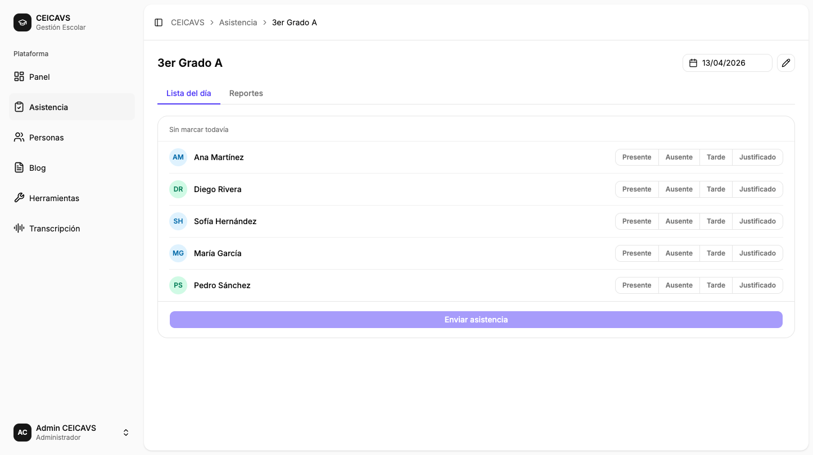
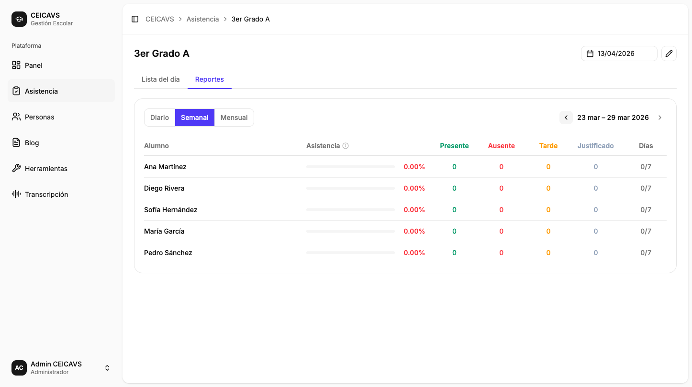

# Reporte de Asistencia del Grupo

**Category:** Asistencia
**Access:** Administrador, Docente, Estudiante
**URL:** `/attendance/:id` → pestaña "Reportes"

## What This Does

Dentro de la página de detalle de un grupo, la pestaña **Reportes** muestra un resumen estadístico de asistencia por estudiante para un período seleccionado. El docente puede navegar entre períodos (diario, semanal, mensual) y ver de un vistazo quién tiene bajo rendimiento de asistencia.

## Step-by-Step Walkthrough

### 1. Abrir el detalle del grupo

El usuario navega a `/attendance` y hace clic en la tarjeta de un grupo. La página de detalle muestra dos pestañas en la parte superior: **Lista** y **Reportes**.

### 2. Cambiar a la pestaña Reportes

Al hacer clic en **Reportes**, se carga la tabla de reporte con el período semanal activo por defecto.

### 3. Seleccionar el período

En la parte superior de la tabla hay tres botones: **Diario**, **Semanal** y **Mensual**. Al seleccionar uno, la tabla se recarga mostrando los datos del período correspondiente. El período activo se resalta en índigo.

### 4. Navegar entre períodos

Las flechas `‹` y `›` a la derecha del selector permiten avanzar o retroceder en el tiempo (día, semana o mes, según el período activo). El botón `›` se deshabilita automáticamente cuando se llega al período actual.

### 5. Leer la tabla de resultados

La tabla muestra una fila por estudiante con las siguientes columnas:

| Columna | Descripción |
|---------|-------------|
| **Estudiante** | Nombre completo |
| **Asistencia** | Barra de progreso + porcentaje (código de color) |
| **P** (Presente) | Número de días presentes |
| **A** (Ausente) | Número de ausencias |
| **T** (Tardanza) | Número de tardanzas |
| **J** (Justificado) | Número de justificados |
| **Días** | Presentes + tardanzas / total de días registrados |

**Código de color de la barra de asistencia:**
- 🟢 Verde — ≥ 80 %
- 🟡 Ámbar — 30 %–79 %
- 🔴 Rojo — < 30 %

## Important Notes

- Los estudiantes solo ven su propia fila; no pueden ver los datos de sus compañeros.
- El reporte consolida únicamente los días en que se registró asistencia; los días sin registro no cuentan.
- El período predeterminado al abrir la pestaña es **Semanal** (semana en curso).
- La navegación hacia el futuro está bloqueada — no se puede ir más allá del período actual.

## What Can Go Wrong

### Sin datos en el período seleccionado
**Disparador:** No se han registrado asistencias en el período.
**Corrección:** La tabla muestra un estado vacío con un mensaje. Cambia el período o registra asistencia primero.

---

Technical Details

**GraphQL Operations:** `query attendanceReport(groupId: ID!, period: ReportPeriod!, date: String!)`

**ReportPeriod enum:** `DAILY | WEEKLY | MONTHLY`

**Frontend Component:** `apps/web/src/features/attendance/pages/attendance-detail-page.tsx`

**Report Table Component:** `apps/web/src/features/attendance/components/report-table.tsx`

**Hook:** `apps/web/src/features/attendance/hooks/use-attendance-report.ts`

**Database Entities:** `AttendanceRecord`

