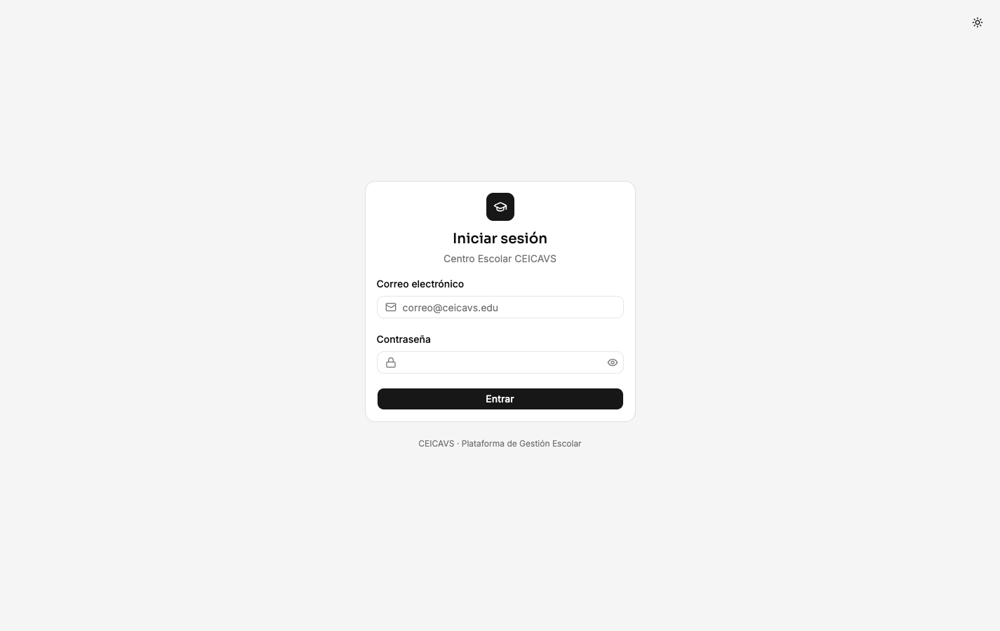
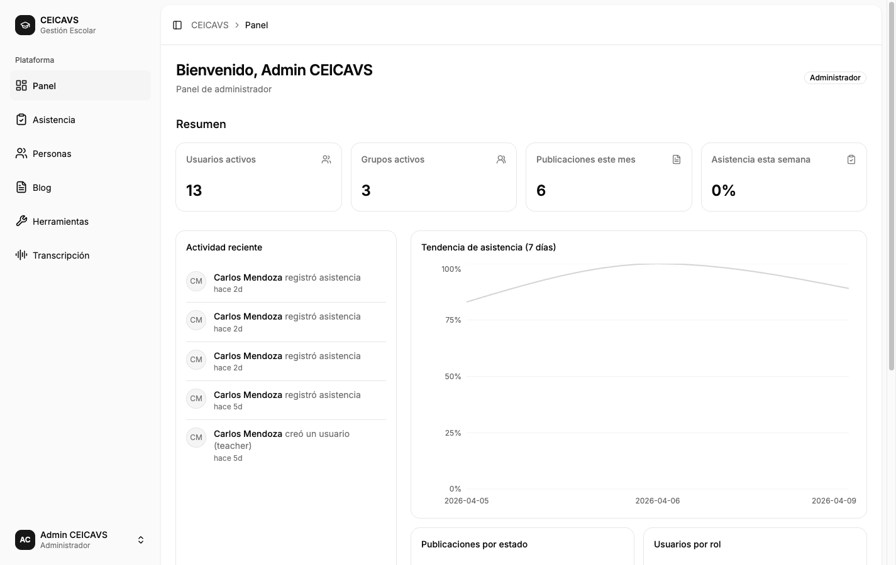
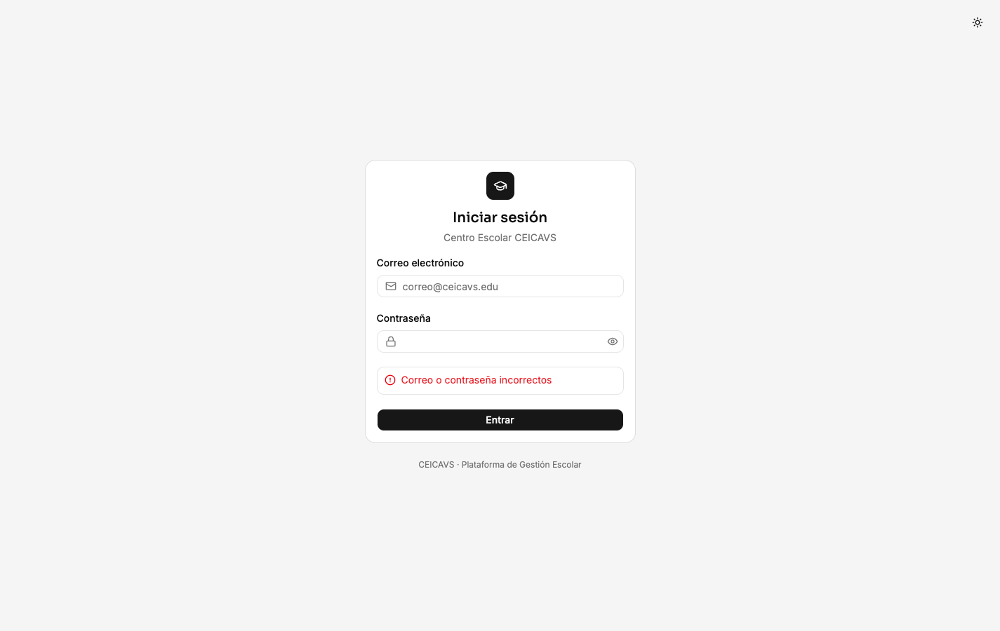

# Iniciar Sesión en la Plataforma

**Category:** Autenticación
**Access:** Todos los roles (administrador, docente, estudiante)
**URL:** `/login`

## What This Does

El usuario abre la página de inicio de sesión, ingresa su correo electrónico y contraseña, y es redirigido al panel de control correspondiente a su rol. Los tokens de acceso y refresco se almacenan en `localStorage` para mantener la sesión activa entre recargas de página.

## Step-by-Step Walkthrough

### 1. Abrir la página de inicio de sesión

El usuario navega a `/login`. Verá un formulario centrado con dos campos: correo electrónico y contraseña. El botón "Iniciar Sesión" está habilitado desde el inicio.

### 2. Ingresar las credenciales

El usuario escribe su correo institucional (ej. `admin@ceicavs.edu`) y contraseña. Hay un botón de ojo para mostrar/ocultar la contraseña.

### 3. Ver la contraseña (opcional)

Al hacer clic en el ícono de ojo, la contraseña se muestra en texto plano para que el usuario pueda verificarla.

### 4. Enviar el formulario
El usuario hace clic en "Iniciar Sesión". La plataforma ejecuta la mutación GraphQL `login` con las credenciales proporcionadas.

### 5. Redirección al panel de control

Tras autenticarse correctamente, el usuario es redirigido a `/dashboard`. El panel muestra contenido diferente según el rol: estadísticas globales para administradores, datos de grupos para docentes, o asistencia personal para estudiantes.

## Important Notes

- Los tokens se almacenan en `localStorage` bajo las claves `accessToken` y `refreshToken`.
- La sesión se hidrata automáticamente al recargar la página mediante `AppBootstrap`.
- Las rutas protegidas redirigen a `/login` si no hay sesión activa.
- El token de acceso expira; cuando esto ocurre, el cliente Apollo usa el `refreshToken` automáticamente para obtener uno nuevo.

## What Can Go Wrong

### Credenciales incorrectas

**Disparador:** El usuario ingresa una contraseña incorrecta o un correo que no existe.
**Corrección:** Verificar que el correo corresponda a un usuario registrado y que la contraseña sea correcta. Contactar al administrador si se olvidó la contraseña.

### Campos vacíos
**Disparador:** El usuario intenta enviar el formulario sin completar los campos.
**Corrección:** Los mensajes de validación aparecen debajo de los campos vacíos indicando cuáles son requeridos.

---

Technical Details

**GraphQL Operations:** `mutation login($email: String!, $password: String!): AuthTokens`

**Frontend Component:** `apps/web/src/features/auth/LoginPage.tsx`

**Database Entities:** `User` (verifica email y contraseña hasheada con bcrypt)

**Token Storage:** `localStorage.accessToken`, `localStorage.refreshToken`

**Auth Context:** `apps/web/src/context/auth.context.tsx`

