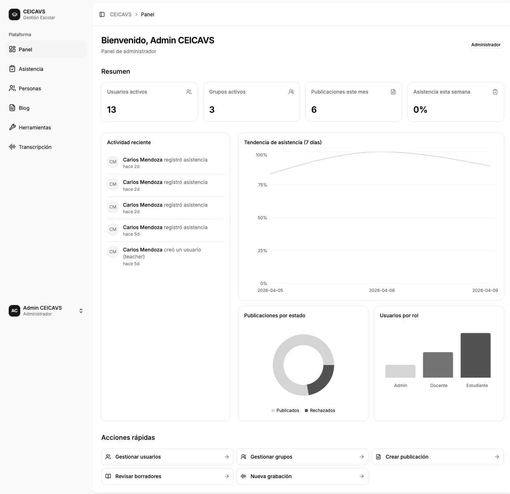
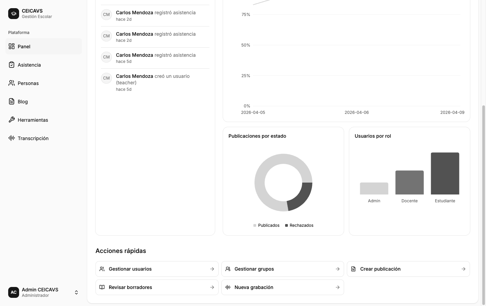

# Panel de Control del Administrador

**Category:** Panel de Control
**Access:** Administrador
**URL:** `/dashboard`

## What This Does

El administrador accede al panel para obtener una visión general del estado de la plataforma: cantidad de usuarios por rol, estado de publicaciones en el blog, gráfica de asistencia a lo largo del tiempo, actividad reciente y accesos directos a las acciones más frecuentes.

## Step-by-Step Walkthrough

### 1. Vista inicial del panel

Al ingresar a `/dashboard`, el administrador ve tarjetas de estadísticas en la parte superior: total de usuarios desglosado por rol (administradores, docentes, estudiantes), total de publicaciones en el blog por estado (publicadas, borradores, rechazadas), y el total de grupos existentes.

### 2. Vista superior — tarjetas de estadísticas

Las tarjetas de estadísticas muestran números en tiempo real consultados desde la API mediante la query `adminDashboard`.

### 3. Sección de gráficas

Al desplazarse hacia abajo, aparecen las gráficas: una línea de tiempo de asistencia (presentes/ausentes/tardanzas por día) y un gráfico de dona con la distribución de estados de publicaciones del blog.

### 4. Actividad reciente y acciones rápidas

La sección inferior muestra el feed de actividad reciente (creación de usuarios, envíos de asistencia, publicaciones nuevas) y botones de acceso rápido para navegar a las secciones más utilizadas: Personas, Asistencia, Blog.

## Important Notes

- El panel del administrador muestra datos de toda la plataforma; otros roles ven únicamente sus propios datos.
- Las gráficas usan datos de los últimos 30 días por defecto.
- La actividad reciente muestra los últimos 10 eventos del sistema.
- Si no hay datos aún (plataforma nueva), las tarjetas muestran cero y las gráficas aparecen vacías.

## What Can Go Wrong

### Error al cargar estadísticas
**Disparador:** La API no responde o hay un error en la base de datos.
**Corrección:** Los componentes muestran esqueletos de carga (skeleton loaders) mientras esperan. Si el error persiste, se muestra un mensaje de error con opción de reintentar.

---

Technical Details

**GraphQL Operations:** `query adminDashboard`, `query recentActivity`

**Frontend Component:** `apps/web/src/features/dashboard/DashboardPage.tsx`

**Database Entities:** `User`, `Group`, `Post`, `AttendanceRecord`, `Activity`

