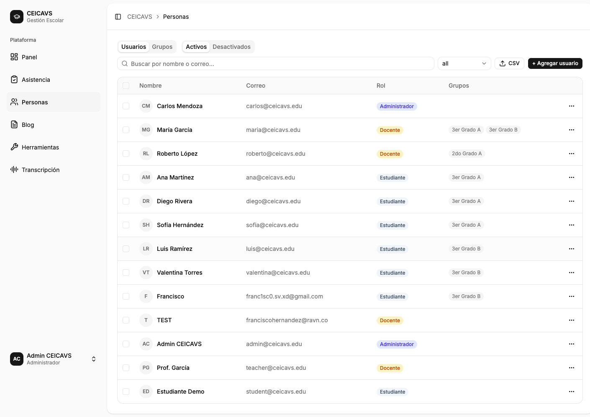
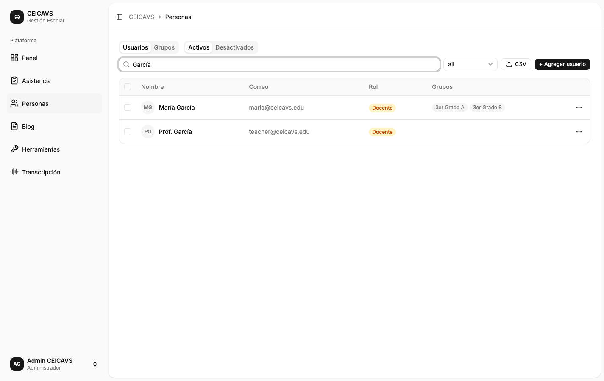
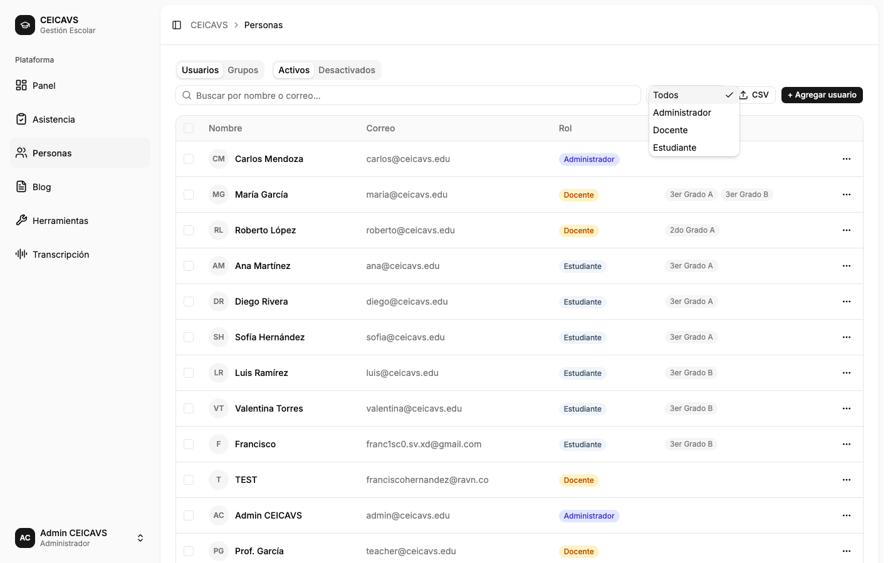
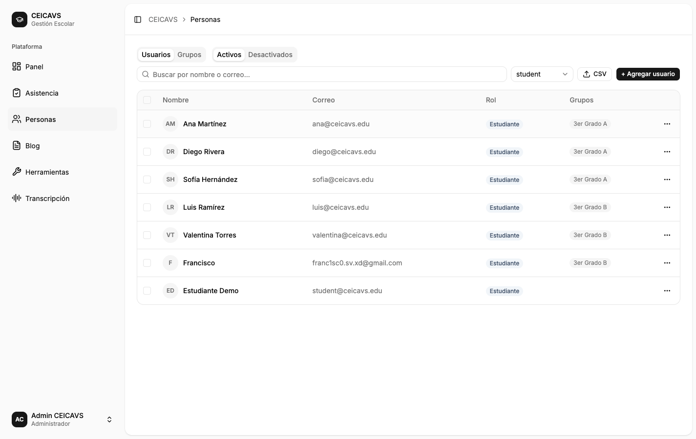

# Gestión de Usuarios (Administrador)

**Category:** Personas
**Access:** Administrador
**URL:** `/people`

## What This Does

El administrador visualiza todos los usuarios de la plataforma en una tabla con búsqueda y filtros, puede crear nuevos usuarios, editar usuarios existentes, eliminarlos individualmente o en masa, y exportar la lista a CSV.

## Step-by-Step Walkthrough

### 1. Vista de la tabla de usuarios

Al navegar a `/people`, el administrador ve la pestaña "Usuarios" activa con una tabla que muestra nombre, correo electrónico y rol de cada usuario. Hay una barra de búsqueda en la parte superior y un selector de filtro por rol.

### 2. Buscar un usuario

Al escribir en el campo de búsqueda (ej. "García"), la tabla se filtra en tiempo real mostrando solo los usuarios cuyos nombres o correos coinciden con el término ingresado.

### 3. Filtrar por rol — selector abierto

Al hacer clic en el selector de rol, se despliegan las opciones: Todos, Administrador, Docente, Estudiante. El filtro se aplica inmediatamente al seleccionar una opción.

### 4. Filtrar por rol — Estudiante seleccionado

Con el filtro "Estudiante" activo, la tabla muestra únicamente los usuarios con ese rol. El selector indica visualmente qué filtro está aplicado.

### 5. Menú de acciones por usuario
Para abrir el menú de acciones de un usuario específico, el administrador hace clic en el botón "⋯" (tres puntos) en la columna de acciones. Aparecen las opciones: Editar y Eliminar.

### 6. Editar un usuario
Al seleccionar "Editar", se abre un panel lateral (sheet) con el formulario prellenado con los datos actuales del usuario: nombre, correo electrónico y rol. El administrador modifica los campos deseados y hace clic en "Guardar". La mutación `updateUser` actualiza los datos en la base de datos y la tabla se refresca.

### 7. Crear un nuevo usuario
El administrador hace clic en el botón "+ Agregar usuario" para abrir el sheet de creación. Completa los campos: nombre, correo electrónico, contraseña temporal y rol. Al guardar, se ejecuta `createUser` y el nuevo usuario aparece en la tabla.

### 8. Selección múltiple y acciones en masa
Al marcar los checkboxes de dos o más usuarios, aparece una barra de acciones en masa en la parte inferior o superior de la tabla. Desde ahí, el administrador puede eliminar todos los seleccionados con `bulkDeleteUsers` o cambiar su rol con `bulkUpdateUsers`.

### 9. Exportar a CSV
El administrador hace clic en el botón de exportación CSV para descargar un archivo con todos los usuarios visibles (aplicando los filtros activos).

## Important Notes

- Solo el rol **administrador** puede crear, editar o eliminar usuarios.
- Los docentes pueden ver la lista de usuarios pero no pueden modificarla.
- La contraseña se hashea con bcrypt antes de almacenarse; nunca se muestra en texto plano.
- No es posible eliminar el propio usuario con el que se inició sesión.
- La eliminación es lógica (soft delete): el campo `deletedAt` se marca pero el registro permanece en la base de datos.

## What Can Go Wrong

### Correo electrónico duplicado
**Disparador:** El administrador intenta crear un usuario con un correo que ya existe.
**Corrección:** Se muestra un mensaje de error en el campo de correo electrónico indicando que ya está en uso.

### Contraseña débil
**Disparador:** La contraseña no cumple los requisitos mínimos de seguridad.
**Corrección:** Se muestra un mensaje de validación debajo del campo de contraseña especificando los requisitos.

---

Technical Details

**GraphQL Operations:** `query users`, `query user`, `mutation createUser`, `mutation updateUser`, `mutation deleteUser`, `mutation bulkDeleteUsers`, `mutation bulkUpdateUsers`

**Frontend Component:** `apps/web/src/features/people/PeoplePage.tsx`

**Database Entities:** `User`

**CASL Permission:** `Action.CREATE` + `Subject.USER` (solo admin)

